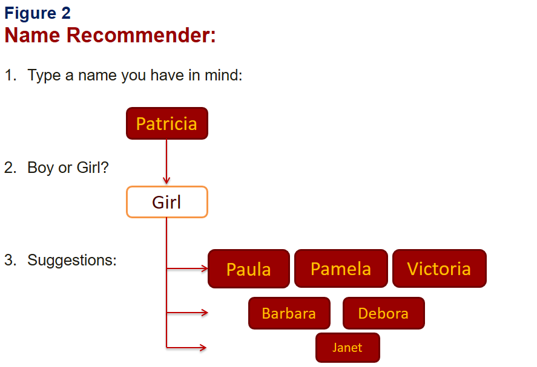
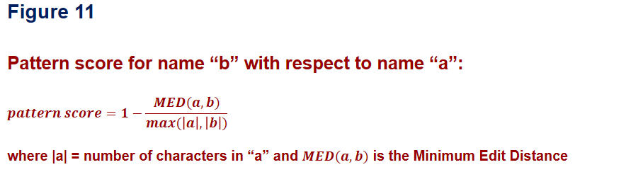
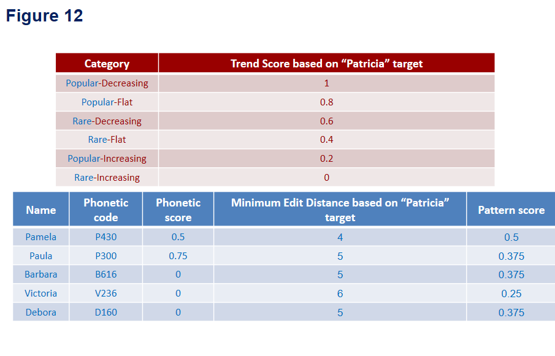
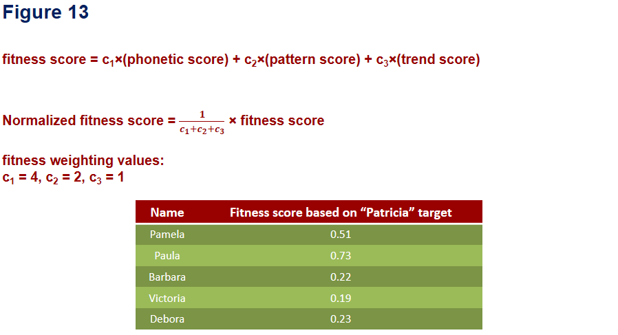

# Table of Contents
1. [Introduction](README.md#introduction)
2. [Dataset Overview](README.md#Dataset-Overview)
3. [Preliminary analysis](README.md#Preliminary-analysis)
4. [Genetic Algorithm](README.md#Genetic-Algorithm)
5. [Implementation details](README.md#implementation-details)
6. [Input files](README.md#input-files)
7. [Input files](README.md#input-files)

# Introduction
People always rely on recommendations from other people, media, and reviews to make decisions in everyday life. Recommender systems augment this natural social process to help people go through available movies, music, restaurants, and products to find the best option. Movie suggestions in Netflix and product suggestions at Amazon are just two examples of many widely used recommender systems.

For my project I propose a Baby Name Recommender System (BNRS). BNRS automatically generates suggestion for couples who are expecting a newborn. Couples usually spend lot of time searching for suggestions for baby names. BNRS use large databases and Genetic Algorithms (GA) to provide inspirations. For example, it can rank the popular names based on geographical area. You can also see which names are currently "Hot" in terms of trends. 

Sometimes, you have a name in mind but you are looking for other alternatives close to it. BNRS has the capability to get a name as an input, and by specifying the gender of the baby, it will provide name suggestions that are similar to the original name. 

# Dataset Overview

I utilized the data from Social Security Card Applications for names of all babies born from 1910 to 2016 [1]. For each name, it includes number of babies born with that name for a specific year at each state. 

# Preliminary analysis

I first conducted an analysis to identify the general statistics of the data. I stacked the data of all states to generate a national database. To find Hot names, I had to find out which names are currently increasing in time. I used linear regression to fit the total counts of each name as a function of year but only for data after year 2000. If the slope of the regression line is significantly greater than zero, the name is considered to be Hot (See Plot1.ipynb).   

I also classified names based on popularity. To find out which names are "Popular", I calculated mean count through the years for all names. By plotting the histogram, I could identify the popular names as the ones in the bin with a maximum height (See Plot2.ipynb). 

Therefore, the combination of trend and popularity classification could uniquely specify the decision boundaries (See Plot2.ipynb). BNRS uses these decision boundaries to provide raw suggestions for baby names.

I also plan to perform the classification for certain geographical areas. For example, the decision boundaries can be generated for each state, or each division. Similarly, trends can be identified for each gender. It is also possible to identify the "unisex" names and the corresponding trends.

# Genetic Algorithm

The novelty of the project is the ability to generate names using a given initial guess. Since the search domain is massive and by providing a single name, we are not sure what we are looking for, I incorporated GA to search for the best recommendations. Figure 7 demonstrates the top view flow chart of GA. 

The process begins with initialization of a random generation of names for the database of all names that a have the same gender as the input name. Then a "fitness score" is calculated to rank the generated names based on their similarity to the input. Subsequently, the fittest candidates are used for the next step of GA to get a new generation using mutation of the encoded names [2]. In the next iteration, the fitness of the new generation is evaluated and compared to a "stopping criterion". This criterion makes the algorithm repeat the iterations until satisfactory tolerances (based on the number of iterations and the desired fitness score) are obtained. 

# Implementation details

The challenges of the implementation are listed as follows:

1-	gene representation.

2-	defining an efficient mutation procedure.

3-	defining a suitable fitness score.

I used Soundex phonetic algorithm [3,4] to convert names into 4-character codes. Soundex encoding is based on how names are pronounced. It keeps the first character in the name and converts the rest into 7 categories according to the following encoding table. 

For example, "Patricia" turns into "P360" after encoding. Moreover, “Reynold” and “Renauld” both reduce to “R543”. Soundex representation clusters names efficiently while providing a basis for defining a mutation procedure which can be performed simply by randomly choosing an index from the coded name and changing the character in that index to another possible character.  For example, by mutating the first character of the “E350” code which is the code for name “Eden”, it is possible to get the “A350” code which is the code for the name “Aden”. 

I used a combination of “phonetic similarity”, “pattern similarity”, and “trend similarity” to evaluate the fitness of the candidate names. “Trend score” is a real number between 0 and 1. Score of 0 means that the candidate has the least similarity to the input in terms of trend (Hot or Not) and popularity. On the other hand, trend score of 1 means that the candidate belongs to the same Trend-Popularity category as the input. Similarly, the higher the phonetic/pattern score, the closer the candidate to the pronunciation/string-format of the input name. The phonetic score was calculated based on the character to character comparison between the encoded versions of the input and the candidates. 

The scores are normalized using weights. The weighting of the score of each character is an integer representing the importance of the character in the phonetic similarity. The higher the weighting, the more important the character. For initial tests, following weightings were chosen:

Similarly, “pattern score” was calculated using the Minimum Edit Distance (MED) formula [3,4] which is the smallest number of edit operations (insertions, deletions and substitutions) required to change one string into another. 

At last, phonetic score, pattern scores and trend score were combined to generate a single fitness score.

